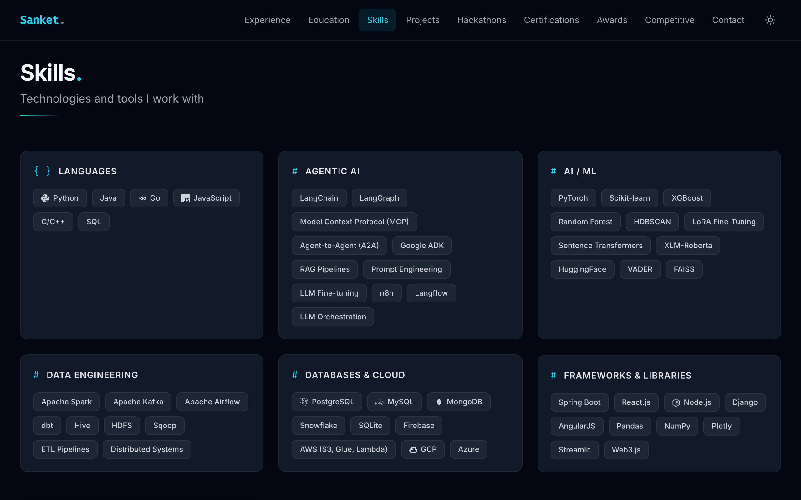
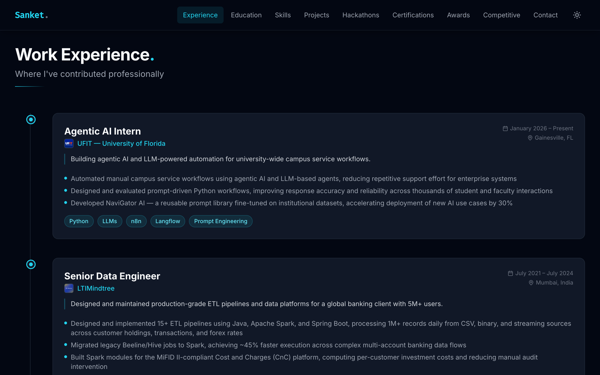
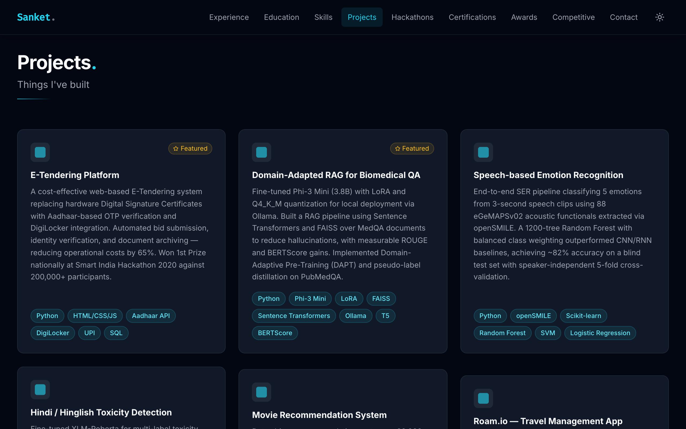
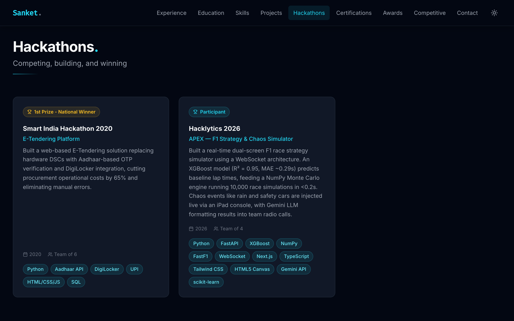
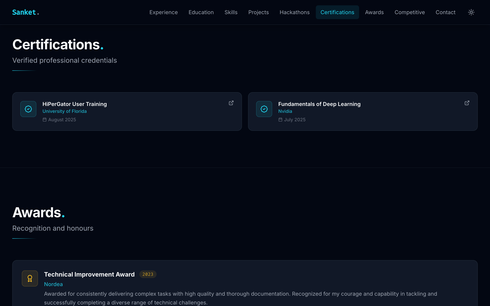
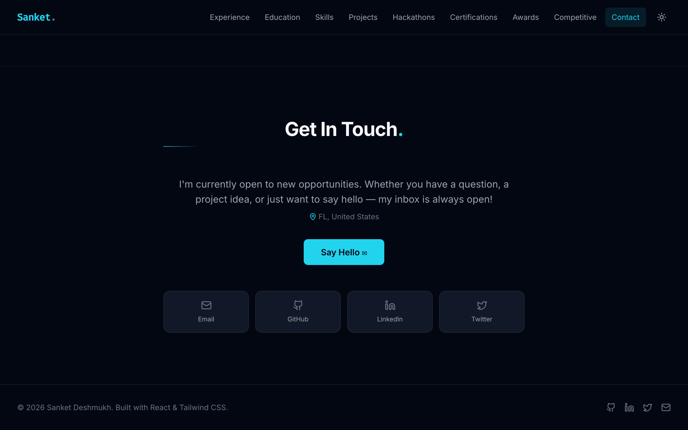

# Sanket Deshmukh — Portfolio

A modern, responsive developer portfolio built with **React 19** and **Vite**, styled with **Tailwind CSS** and animated with **Framer Motion**. All content is driven by a single JSON file — no code changes needed to update your info.

---

## 🌐 Live Demo

**[sanket1305.github.io/Portfolio](https://sanket1305.github.io/Portfolio/)**

---

## Screenshots

### Hero


### Skills


### Work Experience


### Projects


### Hackathons


### Certifications & Awards


### Contact


---

## Tech Stack

| Layer | Technology |
|---|---|
| Framework | React 19 |
| Build Tool | Vite 7 |
| Styling | Tailwind CSS 3 |
| Animations | Framer Motion |
| Icons | Lucide React, React Icons |
| Deployment | GitHub Pages |
| CI/CD | GitHub Actions |

---

## Project Structure

```
Portfolio/
├── .github/
│   └── workflows/
│       └── update-leetcode-stats.yml  # Daily LeetCode stats update + deploy
├── public/
│   └── leetcode-stats.json            # Auto-updated by GitHub Actions
├── src/
│   ├── assets/              # Images and static files used in JSX
│   ├── components/
│   │   ├── layout/          # Navbar, Footer
│   │   ├── sections/        # Hero, Skills, WorkExperience, Projects,
│   │   │                    #   Hackathons, Certifications, Awards, Contact
│   │   └── ui/              # Reusable UI primitives
│   ├── data/
│   │   └── portfolio.json   # ← All site content lives here
│   ├── hooks/
│   │   └── useLeetCodeStats.js  # Reads from local JSON (no external API)
│   ├── App.jsx
│   └── index.css
├── docs/
│   └── screenshots/         # README screenshots (auto-generated)
├── scripts/
│   └── take-screenshots.mjs # Puppeteer screenshot helper
├── vite.config.js
└── package.json
```

---

## Getting Started

### Prerequisites

- Node.js 18+
- npm

### Installation

```bash
# Clone the repository
git clone https://github.com/deshmukhsanket/Portfolio.git
cd Portfolio

# Install dependencies
npm install

# Start the development server
npm run dev
```

The app will be available at `http://localhost:5173`.

### Build for Production

```bash
npm run build       # Outputs to dist/
npm run preview     # Preview the production build locally
```

### Deploy to GitHub Pages

```bash
npm run deploy      # Builds and pushes dist/ to the gh-pages branch
```

---

## Customisation

All content is managed through a single file: **`src/data/portfolio.json`**

| Key | What it controls |
|---|---|
| `personal` | Name, title, bio, social links, resume URL |
| `workExperience` | Job history with role, company, bullets, and tech stack |
| `education` | Degrees, institutions, GPA, highlights |
| `skills` | Skill categories and individual skills |
| `projects` | Project cards with description, tech, GitHub, and demo links |
| `hackathons` | Hackathon events, results, and project descriptions |
| `certifications` | Certifications with issuer, date, and credential URL |
| `awards` | Awards and recognitions |
| `competitiveProgramming` | LeetCode / Codeforces profile and stats |

---

## LeetCode Stats (Auto-Updated)

LeetCode problem counts are fetched **server-side** by a GitHub Actions workflow that runs every day at 2 AM UTC. It hits LeetCode's GraphQL API, updates `public/leetcode-stats.json`, rebuilds the site, and deploys — no third-party API service required.

To enable it, go to **Settings → Actions → General** and set **Workflow permissions** to **Read and write**.

You can also trigger it manually from the **Actions** tab → **Update LeetCode Stats & Deploy** → **Run workflow**.

---

## Regenerating Screenshots

```bash
# Make sure the dev server is running first
npm run dev

# Then in a separate terminal
node scripts/take-screenshots.mjs
```

Screenshots are saved to `docs/screenshots/`.

---

## License

This project is open source and available under the [MIT License](LICENSE).
