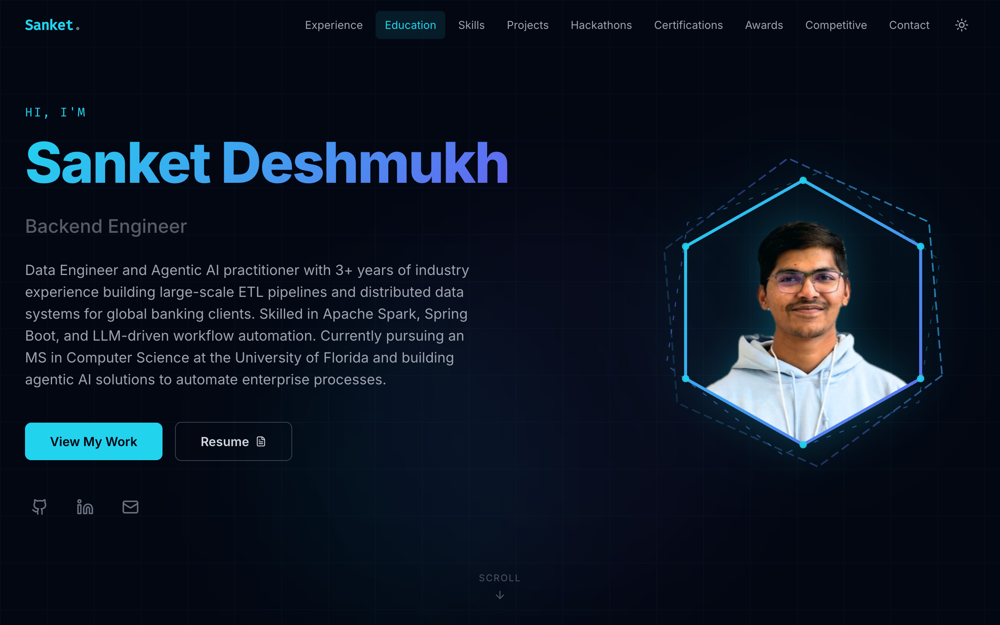

# Sanket Deshmukh — Portfolio

A modern, responsive developer portfolio built with **React 19** and **Vite**, styled with **Tailwind CSS v3** and animated with **Framer Motion**. All content is driven by a single JSON file — no code changes needed to update your info.

---

## 🌐 Live Demo

**[sanket1305.github.io/Portfolio](https://sanket1305.github.io/Portfolio/)**

---

## Screenshot

### Hero Section


> Visit the **[live demo](https://sanket1305.github.io/Portfolio/)** to see all sections — it always reflects the latest deployed version.

---

## ✨ Features

### 🎨 UI & Design
- **Cyan → Indigo gradient theme** consistent across all cards, the "View My Work" button, chatbot, and the animated name gradient
- **Dark / Light mode** toggle with persistent preference via `localStorage` — sun icon turns yellow in dark mode, filled moon in light mode
- Fully **responsive** — mobile-first with dedicated mobile timeline and grid breakpoints
- **Scroll-triggered animations** via Framer Motion `whileInView` on every section

### 💬 Portfolio Chatbot
- Floating **chat assistant** (bottom-right) — cyan → indigo gradient button with animated open/close icon
- **19 intent categories**: About, Work Experience, Skills, Education, Projects, Hackathons, Awards, Certifications, Competitive Programming, AI/ML, Data Engineering, Blockchain, Location, Socials, Resume, Contact, and more
- **Typing indicator** with bouncing dots before each bot response
- **Quick-reply chips** on every bot message for one-click follow-ups
- **Section navigation buttons** — bot replies include a CTA that smooth-scrolls to the relevant section and closes chat
- **Unread badge** on the button when a reply arrives while chat is closed
- Rule-based / zero external API — works fully on static hosting

### 🏠 Hero
- **Coin-flip hexagon avatar** — auto-flips to LeetCode stats panel on load (returns after 3 s); click anytime to flip manually
- Dual counter-rotating SVG hex rings with cyan ↔ indigo gradient stroke
- Animated **role ticker** cycling through titles every 2.5 s
- CTA buttons: **View My Work** (gradient) + **Resume** (opens modal PDF viewer)
- GitHub, LinkedIn, Email icon links

### 💼 Work Experience
- **Alternating left-right timeline** — center vertical line, briefcase nodes, gradient cards with rotated-square speech-bubble arrows
- Cards: company logo, role, duration, location, description, bullet points, tech badges
- Dedicated **mobile layout** with left-aligned single-column timeline

### 🚀 Projects & Hackathons
- **3D flip cards** — front shows image + title; back shows full description, tech stack, GitHub and live demo links

### 🛠️ Skills
- Grouped by category with emoji symbols (Languages, Agentic AI, AI/ML, Data Engineering, Databases & Cloud, Frameworks & Libraries, Data Visualization, DevOps & Tools)
- Every skill badge has a matching icon from `react-icons` (si / fa / tb / di sets) — `FaCode` as universal fallback
- Gradient category cards with `bg-white/10` pill badges on hover

### 🎓 Education
- Gradient cards with GPA badge, degree, institution, duration, and highlight bullets with cyan dot markers

### 📜 Certifications
- Gradient cards with issuer, date, `BadgeCheck` icon, and direct credential URL link

### 🏆 Awards
- Flip cards — front: award image; back: full description

### 🥇 Competitive Programming
- **PPO offer cards** — competition name + company logo on front; slide-up hover panel with "How I got it" description
- LeetCode stats (Easy / Medium / Hard) displayed in the Hero flip card, fetched from a locally cached JSON

### 📬 Contact
- Contact form + social links section

---

## Tech Stack

| Layer | Technology |
|---|---|
| Framework | React 19 |
| Build Tool | Vite 7 |
| Styling | Tailwind CSS 3 |
| Animations | Framer Motion |
| Icons | Lucide React, React Icons (si, fa, tb, di, bi) |
| Deployment | GitHub Pages |
| CI/CD | GitHub Actions |

---

## Project Structure

```
Portfolio/
├── .github/
│   └── workflows/
│       └── update-leetcode-stats.yml      # Daily LeetCode stats fetch + redeploy
├── public/
│   ├── leetcode-stats.json                # Auto-updated by GitHub Actions
│   └── images/
│       ├── profile/                       # Profile photo (Sanket.png)
│       ├── companies/                     # Company / PPO logos
│       ├── projects/                      # Project card images
│       ├── hackathons/                    # Hackathon card images
│       └── awards/                        # Award images / SVGs
├── src/
│   ├── components/
│   │   ├── layout/
│   │   │   ├── Navbar.jsx                 # Sticky nav, dark/light toggle
│   │   │   └── Footer.jsx
│   │   ├── sections/
│   │   │   ├── Hero.jsx                   # Coin-flip hexagon + LeetCode stats
│   │   │   ├── WorkExperience.jsx         # Alternating timeline
│   │   │   ├── Hackathons.jsx             # Flip cards
│   │   │   ├── Projects.jsx               # Flip cards
│   │   │   ├── Skills.jsx                 # Icon badge grid by category
│   │   │   ├── Education.jsx              # Gradient cards
│   │   │   ├── Certifications.jsx         # Gradient cards + credential links
│   │   │   ├── Awards.jsx                 # Flip cards
│   │   │   ├── CompetitiveProgramming.jsx # PPO slide-up cards
│   │   │   └── Contact.jsx
│   │   └── ui/
│   │       ├── PortfolioChatbot.jsx       # Floating chatbot (19 intents)
│   │       ├── SectionWrapper.jsx
│   │       ├── SectionTitle.jsx
│   │       ├── Card.jsx
│   │       └── ResumeModal.jsx
│   ├── data/
│   │   └── portfolio.json                 # ← All site content lives here
│   ├── hooks/
│   │   └── useLeetCodeStats.js            # Reads local JSON, no external API
│   ├── App.jsx
│   └── index.css                          # gradient-text, scrollbar, base styles
├── docs/
│   └── screenshots/                       # README screenshots
├── vite.config.js                         # base: '/Portfolio/' for GitHub Pages
└── package.json
```

---

## Getting Started

### Prerequisites

- Node.js 18+
- npm

### Installation

```bash
# Clone the repository
git clone https://github.com/sanket1305/Portfolio.git
cd Portfolio

# Install dependencies
npm install

# Start the development server
npm run dev
```

The app will be available at `http://localhost:5173`.

### Build for Production

```bash
npm run build       # Outputs to dist/
npm run preview     # Preview the production build locally
```

### Deploy to GitHub Pages

The site auto-deploys via GitHub Actions on every push to `main`. To deploy manually:

```bash
npm run deploy      # Builds and pushes dist/ to the gh-pages branch
```

---

## Customisation

All content is managed through **`src/data/portfolio.json`** — no component changes required.

| Key | What it controls |
|---|---|
| `personal` | Name, title, bio, email, location, social links, resume URL |
| `workExperience` | Jobs: role, company, duration, location, description, bullets, tech |
| `education` | Degrees, institutions, GPA, highlight bullets |
| `skills` | Skill categories and individual skill names |
| `projects` | Cards: image path, description, tech stack, GitHub, demo link |
| `hackathons` | Events: image, result, description, tech |
| `certifications` | Name, issuer, date, credential URL |
| `awards` | Name, issuer, description, image path |
| `competitiveProgramming` | LeetCode profile stats + PPO offers with competition names |

### Adding images

1. Drop the file into the correct subfolder under `public/images/`
2. Reference it in `portfolio.json` as `"images/<subfolder>/filename.ext"` (no leading slash)
3. Components prefix it with `import.meta.env.BASE_URL` automatically — works in both dev and GitHub Pages

---

## LeetCode Stats (Auto-Updated)

LeetCode problem counts are fetched **server-side** by a GitHub Actions workflow at 2 AM UTC daily. It calls LeetCode's GraphQL API, writes `public/leetcode-stats.json`, rebuilds, and redeploys — no third-party service or runtime API key needed.

**Enable:** Settings → Actions → General → Workflow permissions → **Read and write**.

**Manual trigger:** Actions tab → **Update LeetCode Stats & Deploy** → Run workflow.

---

## Chatbot Intent Reference

The chatbot in `src/components/ui/PortfolioChatbot.jsx` is a rule-based engine — zero dependencies, zero API keys, works on any static host.

| Intent | Example keywords |
|---|---|
| Greeting | hi, hello, hey |
| About | who is, background, introduce, summary |
| Work Experience | experience, LTIMindtree, UFIT, career, intern |
| Skills | tech stack, languages, frameworks, tools |
| Education | university, GPA, degree, UF, Mumbai |
| Projects | projects, built, app, application |
| Hackathons | hackathon, SIH, Hacklytics |
| Awards | award, recognition, prize, Nordea |
| Certifications | certification, credential, certified |
| Competitive Programming | LeetCode, PPO, CodeVita, HackWithInfy |
| AI / ML | LLM, agentic, LangChain, RAG, n8n |
| Data Engineering | Spark, Kafka, ETL, pipeline, Airflow |
| Blockchain | Solidity, Web3, smart contract |
| Contact | hire, email, connect, opportunity |
| Resume | resume, CV, download |
| Location | where, city, based, Gainesville |
| Socials | GitHub, LinkedIn, Twitter |

To upgrade to a real LLM chatbot, deploy a Vercel / Netlify serverless function as a proxy and replace `matchIntent` with a `fetch` call to the Claude or OpenAI API.

---

## License

This project is open source and available under the [MIT License](LICENSE).
